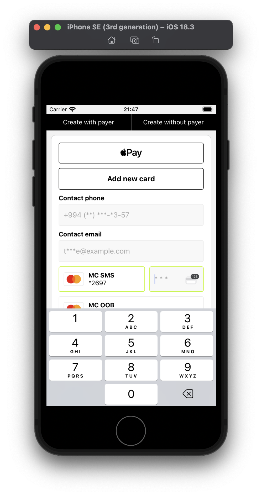
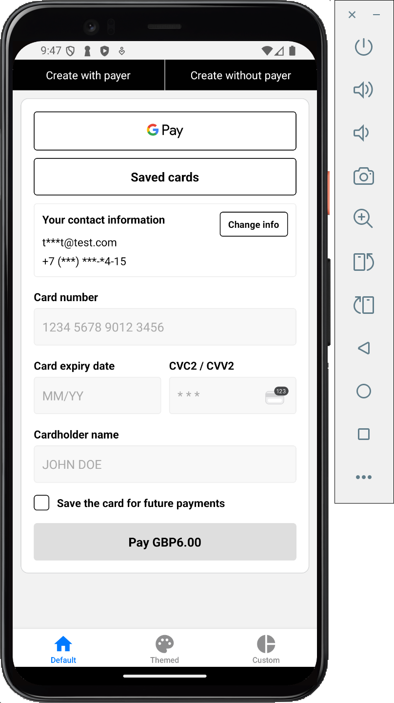
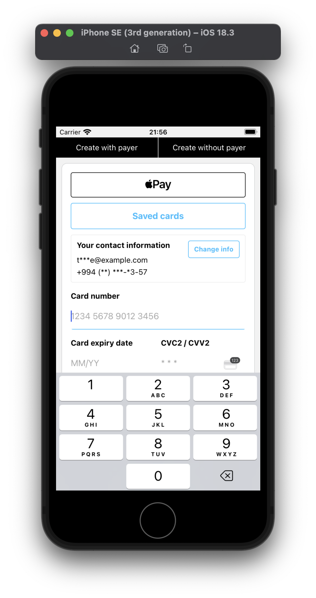
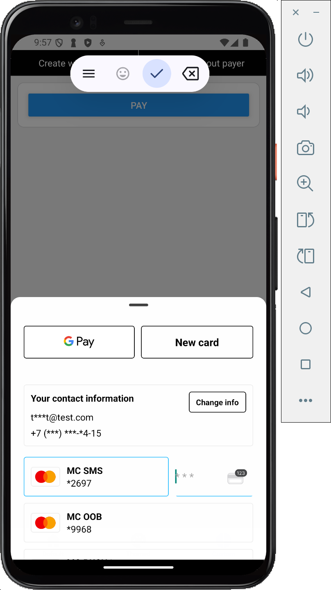

# GuavaPay React Native SDK

## Supported features
- Platform pay
  - Apple pay
  - Google pay
- New card payment
  - Add payer info
  - Save card for future payments
- Saved card payment
  - Pay with saved card
  - Edit saved card
  - Delete saved card
- 3DS Security flow

Pay with saved card        |  Add new card            |  Custom Theme  |   Custom components
:-------------------------:|:-------------------------:|:-------------------------:|:-------------------------:
 |   |  |  

## Installation

Install Guavapay React Native module and its peer dependencies

```bash
npm install @guavapay/myguava-business-payment-sdk-react-native --save
```

```bash
npm install @rnw-community/react-native-payments expo-localization react-native-gesture-handler react-native-reanimated react-native-safe-area-context react-native-svg react-native-webview --save
```

Why do we need these dependencies ?
- @rnw-community/react-native-payments for platform pay integration
- expo-localization and react-native-webview are needed for 3DS verification

Run `prebuild` If you don't have native ios and andoroid directories.

```bash
npx expo prebuild --clean
```

Install pods

```bash
cd ios && pod install && cd ..
```

In order to initialize Guavapay React Native SDK you need valid orderId and session token.
The recommended way to obtain these params is by remote service call. But for testing and development purposes you can use `createOrder` helper method provided by the SDK.

This method accepts API_KEY and order request as an arguments and returns `OrderDetailsResponse`

```ts
const orderRequest = {
  description: {
    textDescription: "...",
  },
  totalAmount: {
    baseUnits: "6.00",
    currency: "GBP",
  },
  expirationOptions: {
    lifespanTimeoutSeconds: 60000,
  },
  payer: {
    id: "100",
    contactEmail: "test@example.com",
    contactPhone: {
      fullNumber: "...",
    },
  },
};
const order = await createOrder(apiKey, orderRequest);
```

## Card Payments Configuration

```ts
import { GuavapayPayments } from "@guavapay/myguava-business-payment-sdk-react-native";

<GuavapayPayments
  orderId={order.order.id}
  sessionToken={order.order.sessionToken}
  onComplete={(order) => {
    console.log(order.order.status)
  }}
  onError={({ error, canRetry, order }) => {
    console.log("onPaymentError", error)
  }}
/>
```

`canRetry` property of an error response shows whether request can be retried or not. For example timeout, unexpected server errors and others can be retried. You can't retry request If order with a given `orderId` not found for ex.

## Platform Setup

GuavaPay React Native SDK is using a wrapper around the [@rnw-community/react-native-payments](https://www.npmjs.com/package/@rnw-community/react-native-payments) package to support platform payments.

## Apple Pay Setup

- ApplePay [overview](https://developer.apple.com/apple-pay/planning/).
- Create [Apple developer account](https://developer.apple.com/programs/enroll/).
- Follow [this guide](https://developer.apple.com/library/archive/ApplePay_Guide/Configuration.html) to setup ApplePay in
  your application.
- Set `merchantIdentifier` (required) to enable Apple Pay in SDK.

```ts
<GuavapayPayments
  orderId={order.order.id}
  sessionToken={order.order.sessionToken}
  onComplete={(order) => {
    console.log(order.order.status)
  }}
  onError={({ error, canRetry, order }) => {
    console.log("onPaymentError", error)
  }}
  applePayConfig={{
    merchantIdentifier: "merchant.com.guavapay.epg",
  }}
/>
```

## Google Pay Setup

- Create [Google developer account](https://support.google.com/googleplay/android-developer/answer/6112435?hl=en).
- Follow [this guide](https://developers.google.com/pay/api/android/guides/setup) to setup Google Pay Api in your
  application.
- [Google payments tutorial](https://developers.google.com/pay/api/android/guides/tutorial)
- [Google brand guidelines](https://developers.google.com/pay/api/android/guides/brand-guidelines)
- Set `gatewayConfig` and `environment` (required) to enable Google Pay in SDK.

```ts
import { GuavapayPayments } from "@guavapay/myguava-business-payment-sdk-react-native";
import { EnvironmentEnum } from '@rnw-community/react-native-payments';

<GuavapayPayments
  orderId={order.order.id}
  sessionToken={order.order.sessionToken}
  onComplete={(order) => {
    console.log(order.order.status)
  }}
  onError={({ error, canRetry, order }) => {
    console.log("onPaymentError", error)
  }}
  googlePayConfig={{
    environment: EnvironmentEnum.TEST,
    gatewayConfig: {
      gateway: "...",
      gatewayMerchantId: "..."
    },
  }}
/>
```

## Customization

You can customize all strings (labels & texts) and the complete theme using labels and theme properties.

```ts
<GuavapayPayments
  strings={{
    pay: "Buy now",
  }}
  theme={{
    applePayButton: {
      buttonStyle: "white-outline",
    },
    googlePayButton: {
      buttonStyle: "white",
      style: {
        borderColor: '#000'
      }
    },
    colors: {
      primary: "#2abdff",
      danger: "red"
    },
    common: {
      borderRadius: 4,
    },
    payButton: {
      default: {
        text: {
          color: "#fff"
        }
      }
    },
    secondaryButton: {
      default: {
        text: {
          color: "#2abdff"
        },
        button: {
          borderColor: "#2abdff"
        }
      }
    },
    input: {
      default: {
        backgroundColor: "transparent",
        borderTopWidth: 0,
        borderLeftWidth: 0,
        borderRightWidth: 0,
        paddingHorizontal: 0
      }
    }
  }}
  orderId={order.order.id}
  sessionToken={order.order.sessionToken}
  onComplete={(order) => {
    console.log(order.order.status)
  }}
  onError={({ error, canRetry, order }) => {
    console.log("onPaymentError", error)
  }}
/>
```

## Complete example

You can find the complete example in `example/App.tsx` file

## Advanced customization
`GuavapayPayments` is a pre-configured root components which includes all supported payment methods.

If you need more advanced customization, then you can use standalone payment components exposed by the module. For example, by default 3DS modal is opened in a fullscreen modal, but you can place it everywhere in your app, in a bottom modal sheet for example.

Payment components should be placed inside of a `GuavapayProvider` component. The `GuavapayProvider` components accepts the same props as `GuavapayPayments` component.

```ts
import { SavedCardPaymentForm, GuavapayProvider, NewCardPaymentForm, PaymentMethod, PlatformPayButton, ThreeDSModal, ThreeDSView, use3DS } from '@guavapay-npm/guavapay-react-native';

const [method, setMethod] = useState<PaymentMethod>(PaymentMethod.PaymentCard);

<GuavapayProvider
  orderId={order.order.id}
  sessionToken={order.order.sessionToken as string}
  onComplete={(order) => {
    console.log(order.order.status)
  }}
  onError={({ error, canRetry, order }) => {
    console.log("onPaymentError", error)
  }}
  applePayConfig={{
    merchantIdentifier: "merchant.com.guavapay.epg",
  }}
  googlePayConfig={{
    environment: EnvironmentEnum.TEST,
    gatewayConfig: {
      gateway: "guavapay",
      gatewayMerchantId: "nuveidigital"
    },
  }}

  env='preprod'
>
  <Fragment>
    <View style={{ flexDirection: 'row', gap: 10, margin: 20 }}>
      <View style={{ flex: 1 }}>
        <PlatformPayButton />
      </View>
      <TouchableOpacity
        style={{ flex: 1, borderWidth: 1, borderColor: '#000', borderRadius: 4, justifyContent: 'center', alignItems: 'center' }}
        onPress={() => setMethod(method === PaymentMethod.PaymentCard ? PaymentMethod.SavedPaymentCard : PaymentMethod.PaymentCard)}
      >
        <Text style={{ fontSize: 16, fontWeight: 'bold' }}>
          {method === PaymentMethod.PaymentCard ? "Saved cards" : "New card"}
        </Text>
      </TouchableOpacity>
    </View>
    <ScrollView>
      <View style={{ padding: 20 }}>
        {method === PaymentMethod.PaymentCard ? <NewCardPaymentForm /> : <SavedCardPaymentForm />}
      </View>
    </ScrollView>
  </Fragment>
  <ThreeDSModal />
</GuavapayProvider>
```

Don't forget to use `<ThreeDSModal />` in your app - It's required for 3DS verification flow. 

If you don't want to use default 3DS modal, then you can use `<ThreeDSView />` component along with `use3DS` hook.

```ts
import { SavedCardPaymentForm, GuavapayProvider, NewCardPaymentForm, PaymentMethod, PlatformPayButton, ThreeDSModal, ThreeDSView, use3DS } from '@guavapay-npm/guavapay-react-native';


const [method, setMethod] = useState<PaymentMethod>(PaymentMethod.PaymentCard);
const [is3DS, setIs3DS] = useState(false);
const { cancel } = use3DS({
  onFinish: () => {
    setIs3DS(false);
  },
  onStart: () => {
    setIs3DS(true);
  }
});


<GuavapayProvider
  orderId={order.order.id}
  sessionToken={order.order.sessionToken as string}
  onComplete={(order) => {
    console.log(order.order.status)
  }}
  onError={({ error, canRetry, order }) => {
    console.log("onPaymentError", error)
  }}
  applePayConfig={{
    merchantIdentifier: "merchant.com.guavapay.epg",
  }}
  googlePayConfig={{
    environment: EnvironmentEnum.TEST,
    gatewayConfig: {
      gateway: "guavapay",
      gatewayMerchantId: "nuveidigital"
    },
  }}

  env='preprod'
>
  {is3DS ? (
    <View style={{ flex: 1, width: '100%', height: '100%' }}>
      <ThreeDSView />
    </View>
  ) : (
    <Fragment>
      <View style={{ flexDirection: 'row', gap: 10, margin: 20 }}>
        <View style={{ flex: 1 }}>
          <PlatformPayButton />
        </View>
        <TouchableOpacity
          style={{ flex: 1, borderWidth: 1, borderColor: '#000', borderRadius: 4, justifyContent: 'center', alignItems: 'center' }}
          onPress={() => setMethod(method === PaymentMethod.PaymentCard ? PaymentMethod.SavedPaymentCard : PaymentMethod.PaymentCard)}
        >
          <Text style={{ fontSize: 16, fontWeight: 'bold' }}>
            {method === PaymentMethod.PaymentCard ? "Saved cards" : "New card"}
          </Text>
        </TouchableOpacity>
      </View>
      <ScrollView>
        <View style={{ padding: 20 }}>
          {method === PaymentMethod.PaymentCard ? <NewCardPaymentForm /> : <SavedCardPaymentForm />}
        </View>
      </ScrollView>
    </Fragment>
  )}
</GuavapayProvider>
```